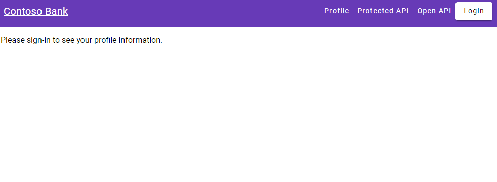
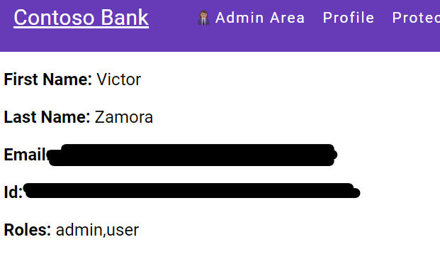
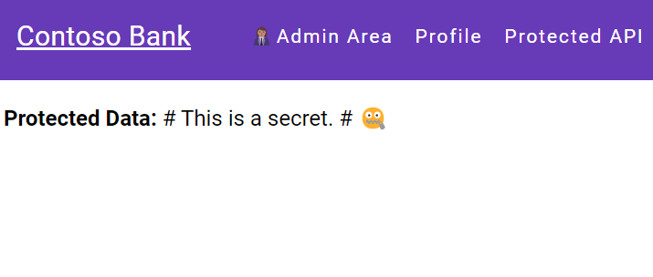
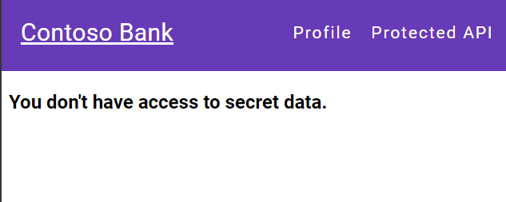
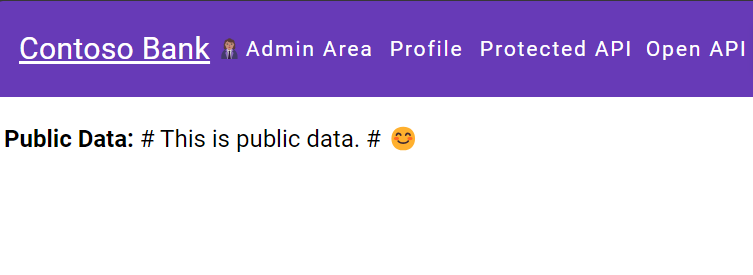

# MSAL with application roles authorization sample

This is a simple demonstration that ilustrate how to use application roles in MS Entra Id to authorize access to REST APIs from SPA applications based on roles granted to authenticated users. 

## Setup

### App registrations

This sample use 2 app registrations, one for the Angular SPA client and another for the backend app. 

#### Client APP

In Microsoft Entra Admin Center, go to App Registrations and create a new app registration with the following data: 
* Name: angular-client-app (or wathever name you want)
* Supported account types: Accounts in this organizational directory only
* Redirect URI: http://localhost:4200 (the URL configured to run the application)

[Check this quick start if you need more information](https://learn.microsoft.com/en-us/entra/identity-platform/quickstart-single-page-app-angular-sign-in#register-the-application-and-record-identifiers)

The next step is to create roles for the app registration, open the registered application, select App roles and Create app role: 
Create 2 roles with the following data: 
* Administrators
  * Display name: Administrators
  * Allowed member types: Users/Groups
  * Value: admin (lower case)
  * Description: Administer application 
* Users
  * Display name: Users
  * Allowed member types: Users/Groups
  * Value: user (lower case)
  * Description: Application users

[Check this link for more details on how to create app roles](https://learn.microsoft.com/en-us/entra/identity-platform/howto-add-app-roles-in-apps#declare-roles-for-an-application)

Now go to Enterprise Applications and enter on the registered app from previous steps and select Users and groups on Manage. In this pane it is possible to add users or groups that will access the app. 
Select Add user/group and on the next screen select one or more users and groups and select the role Administrators. Repeat the steps for role Users. 

[Check this link for more details on how to add users/groups](https://learn.microsoft.com/en-us/entra/identity/enterprise-apps/assign-user-or-group-access-portal?pivots=portal)

On the source code, open the file *angular-msal-app/src/app/app.module.ts* and change the lines below with Clien Id and Tenant Id from the app registration:

``` typescript 
      new PublicClientApplication({
        auth:{
          clientId: "<app client Id>",
          authority: "https://login.microsoftonline.com/<tenant Id>",
          redirectUri: "http://localhost:4200"
        },
```

#### Backend

In Microsoft Entra Admin Center, go to App Registrations and create a new app registration with the following data: 
* Name: msal-backend (or wathever name you want)
* Supported account types: Accounts in this organizational directory only
* Redirect URI: http://localhost:4200 (the URL configured to run the application)

Create one role for the app registration, open the registered application, select App roles and Create app role: 
* Read Secrets
  * Display name: Read Secrets
  * Allowed member types: Users/Groups
  * Value: secret.reader (lower case)
  * Description: Read app secrets

Select Expose an API, on Application ID URI, click add and accept de default URI (api://<client Id>). 
Click on Add a scope and fill with this data: 
* Scope name: api-access (lower case)
* Who can consent: Admins and users
* Admin consent display name: Access to the API
* Admin consent description: Access to the API
* User consent display name: Access to the API
* User consent description: Access to the API

Click Add client application, insert the Client Id of the client app previously created and select the api-access scope. 

[For more details follow this link](https://learn.microsoft.com/en-us/entra/identity-platform/quickstart-configure-app-expose-web-apis)

Now go to Enterprise Applications and enter on the registered app for the backend and add one or more users and groups and select the role Read Secrets.

There are two backend sample apps one written in ASP.NET Core and another in NodeJs/Express. 

To configure the .NET app open the file msal-api/appsettings.json and change the Client Id and Tenant Id as indicated: 

```json
  "AzureAd": {
    "Instance": "https://login.microsoftonline.com/",
    "ClientId": "<API client ID>",
    "TenantId": "<Tenant Id>",
    "Scopes": "api-access"
  },
```

To configure the NodeJs app open the file node-rest-api/config/WEB-API.json and change the Client Id ad Tenant Id as indicated: 

```json
    "authOptions": {
        "audience": "api://<Client Id>",
        "authority": "https://sts.windows.net/<Tenant Id>/",
        "clientSecret": "<ENTER_CLIENT_SECRET>"
    },
    "serverPort": 5224,
    "webApiScope": "api-access",
    "discoveryKeysEndpoint": "https://login.microsoftonline.com/<Tenant Id>/discovery/v2.0/keys"
```

On the client, open the file angular-msal-app/src/app/app.module.ts and replace the scope with the scope created for the registered API backend: 

```typescript 
      {
        interactionType: InteractionType.Redirect,
        protectedResourceMap: new Map([
          ["https://graph.microsoft.com/v1.0/me", ["user.read"]],
          ["http://localhost:5224/*",["api://<API Client Id>/api-access"]],
        ])
```

## Run the demo

Assuming that NodeJs and Angular are already installed, run the client app in a terminal with the commands:

```console
$ cd angular-msal-app
$ npm install
$ npm start
```

If you want to run the .NET backend execute the following command in another terminal, assuming that .NET 8 is installed: 
```console
$ cd msal-api
$ dotnet run 
```

To run the NodeJs backend,  in a terminal execute the commands: 

```console
$ cd node-rest-api 
$ node . 
```

Since both backends are listening on the same port only one can be running at time. Both implement the same interface so the client isn't aware of which one is running. 

Run the app and a backend. 



Any button will start the login process if user isn't logged in. 

The Profile option will display profile information from the Id Token. The Admin Area button will be displayed for users with admin role as a sample of using roles to adapt UI to users: 



The Protected API button will display a # This is a secret. # message for users with the role secret.reader on the backend app: 

 



The Open API button should display a # This is public data # message for any user: 



